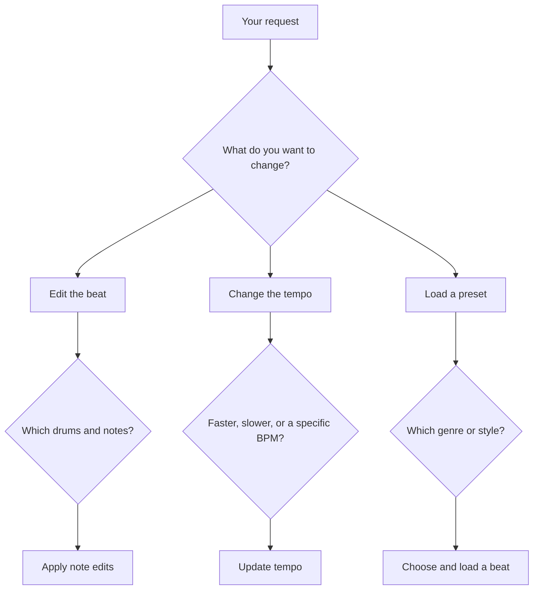

# Jam Partner

A simple, fun, public demo of [Jev](https://typesafe.ai) in the context of building a beat. Tell Jev what you want—“give me a backbeat,” “add some swing,” or “make the snare louder”—and hear the groove change. Feel free to fork, experiment, and contribute!

**[Try the demo →](https://www.jevdrummer.dev/)**

## How it works

Under the hood, requests move through a tree of **soft decisions**: Jev interprets your words and chooses among a small set of supported options at each step. The app follows that branch, asks any needed follow-up questions, and applies the result to the beat.

Here’s a simplified example of the tree:



Jev handles the interpretation; ordinary code handles the changes and audio playback. Its speed makes this a fun way to stay in the creative flow. You can type requests or use **Hold to speak** for voice commands and beatboxing.

## Getting started

Install [Node.js](https://nodejs.org/) 24, then:

```sh
git clone https://github.com/blakewest/jam_buddy.git
cd jam_buddy
npm install
cp .env.example .env
```

Add your [TypeSafe](https://typesafe.ai) API key to `.env`. For voice commands and beatboxing, also add an [OpenRouter](https://openrouter.ai) key for transcription:

```dotenv
TYPESAFE_API_KEY=your_typesafe_key
OPENROUTER_API_KEY=your_openrouter_key
```

Start the app:

```sh
npm start
```

Open [http://127.0.0.1:3210](http://127.0.0.1:3210) in Chrome. API keys stay on the server; patterns and session history stay in your browser.

Run `npm test` to check your changes. Pull requests and [ideas](https://github.com/blakewest/jam_buddy/issues) are welcome.
